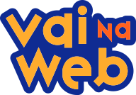

---

<h1 align="center">Finn</h1>

    O Finn é um desafio do curso do VaiNaWeb. Desenvolvemos uma página utilizando recursos do css para desenhar o Finn.

---

<h2 align="center">Design</h2>

---

<h2  align="center">Application demo</h2>

---

<h2  align="center">Project</h2>

---

<h2  align="center">Technologies</h2>

---

<h3 align="center">Academia</h3>

<section>
    
</section>

---

<h3 align="center">Status</h3>

<h4 align="center">
    ✔️ FINALIZADO ✔️
</h4>